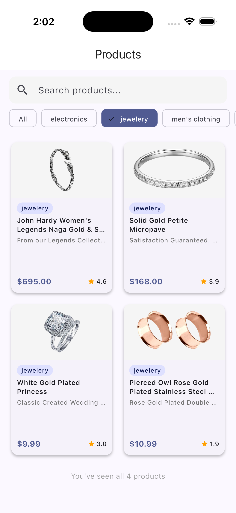

# UAE Product Listing Task

This is a Flutter Product Listing app built using MVC architecture and Provider. It fetches product data from an API and displays it in a responsive UI with product details and smooth user experience.

## Screenshots

  
  
  

  
  

